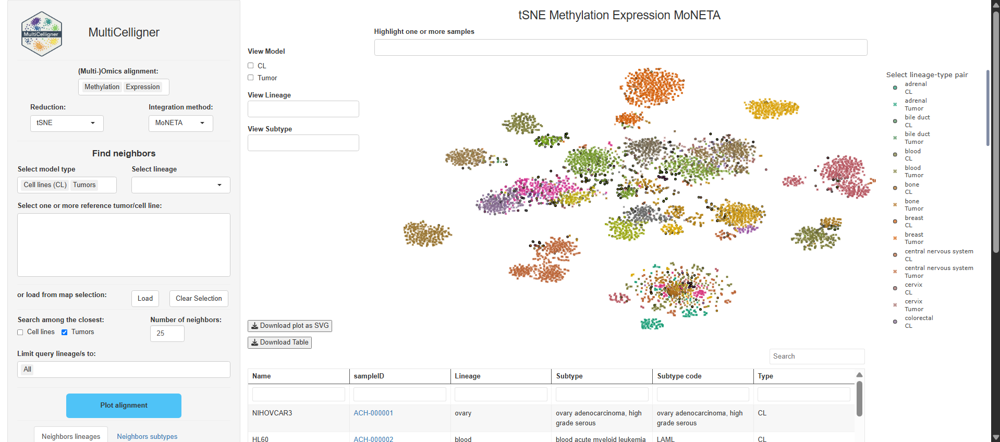

## **MultiCelligner**

------------------------------------------------------------------------

<p align="center">


</p>

------------------------------------------------------------------------

### Introduction

MultiCelligner propose direct comparisons of tumor and cell line based on 
different unsupervised alignment among transcriptional profile, methylation 
profile and mutational signature catalogues. Furthermore, MultiCelligner 
features alignments built on multi-omics integrations of MNN-corrected matrix 
empower complete and precise comparison. Exploit that, MultiCelligner Shiny 
enable user to seek along each omics or multi-omics alignment the best 
cell line model for a given set of tumors or the top k tumors that best 
recapitulate the omic profile of a specific cell line model. 

------------------------------------------------------------------------

### Installation

In R console, run

``` r
library(devtools)
install_github("BioinfoUninaScala/MultiCelligner")
```

------------------------------------------------------------------------

### MultiCelligner Shiny

In R, you can run:

``` r
library(MultiCelligner)
MultiCellignerShiny()
```
### MultiCelligner docker image
To pull the docker image, run in the terminal:
```
$ docker pull bioinfouninascala/MultiCelligner
```

To run the docker image, map http port 3838 on the host port 8585:
```
$ docker run --rm -p 8585:3838 bioinfouninascala/MultiCelligner
```

Finally, use MultiCelligner shiny in a browser by typing http://localhost:8585 (if you are on a local machine) or https://server_name:8585 (if you are on a server machine).
<br/>

------------------------------------------------------------------------

<p align="center">



</p>

------------------------------------------------------------------------

### Disclaimer
This tool is currently in beta. It is still under active development and may contain bugs, errors, or incomplete features. 
We recommend using it with caution, especially in critical or production environments.
By using this beta version, you acknowledge and agree that:
  The tool is provided "as is", without warranties of any kind.
  Performance, accuracy, and stability may vary.
  Feedback is welcome and encouraged to help improve the final release.


