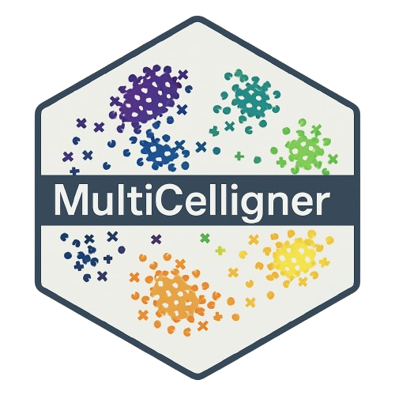

## **MultiCelligner**

------------------------------------------------------------------------

<p align="center">



</p>

------------------------------------------------------------------------

### Introduction

MultiCelligner is a Celligner-based pipeline for aligning tumor and cell
line expression, methylation and mutational signature data.
MultiCelligner also provides a Shiny App that allows users to explore
dimensionality reduction projections in order to find the best cell line
model for a tumor sample or for a set of them at the subtype resolution.

------------------------------------------------------------------------

### Installation

In R console, run

``` r
library(devtools)
install_github("BioinfoUninaScala/MultiCelligner")
```

------------------------------------------------------------------------

### MultiCelligner Shiny

In R, you can run:

``` r
library(MultiCelligner)
MultiCellignerShiny()
```

### MultiCelligner function


