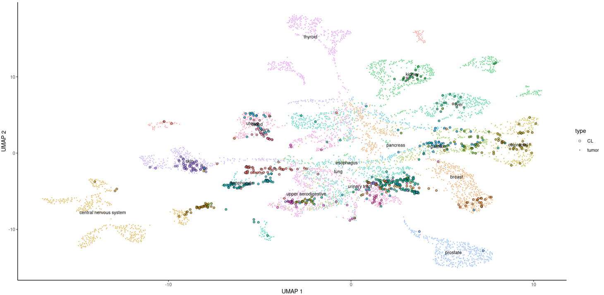

## **MultiCelligner**

------------------------------------------------------------------------

<p align="right">



</p>

------------------------------------------------------------------------

### Introduction

MultiCelligner is a Celligner-based pipeline for aligning tumor and cell
line expression, methylation and mutational signature data.
MultiCelligner also provides a Shiny App that allows users to explore
dimensionality reduction projections in order to find the best cell line
model for a tumor sample or for a set of them at the subtype resolution.

------------------------------------------------------------------------

### Installation

In R console, run

``` r
library(devtools)
install_github("BioinfoUninaScala/MultiCelligner")
```

------------------------------------------------------------------------

### MultiCelligner Shiny

In R, you can run:

``` r
library(MultiCelligner)
MultiCellignerShiny()
```

### MultiCelligner function

-   `find_neighbors_tumor` :allows to point out the k nearest tumor
    neighbors for query sample
-   `find_neighbors_CL`:allows to point out the k nearest cell line
    neighbors for quey sample
-   `find_neighbors_both`:allows to point out the k nearest neighbors
    for query sample
    
    ------------------------------------------------------------------------
    
-   `get_neighbors table_tumor` : creating a distance ordered datatable for k neighbors tumor samples with lineage and subtype information 
-   `get_neighbors table_CL` : creating a distance ordered datatable for k neighbors cell line samples with lineage and subtype information 
-   `get_neighbors table_both` : creating a distance ordered datatable for k neighbors sample with lineage and subtype information

------------------------------------------------------------------------

-   `get_piechart_tumor` : generating a pie chart based on lineage percentage for query tumors neighbors
-   `get_piechart_CL` : generating a pie chart based on lineage percentage for query cell lines neighbors
-   `get_piechart_both` : generating a pie chart based on lineage percentage for query neighbors


